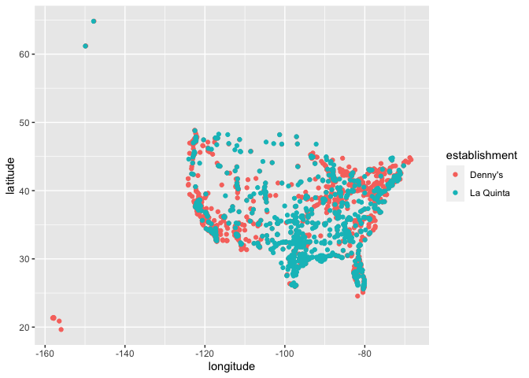
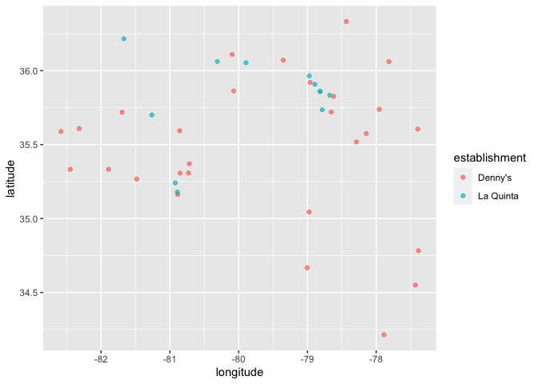
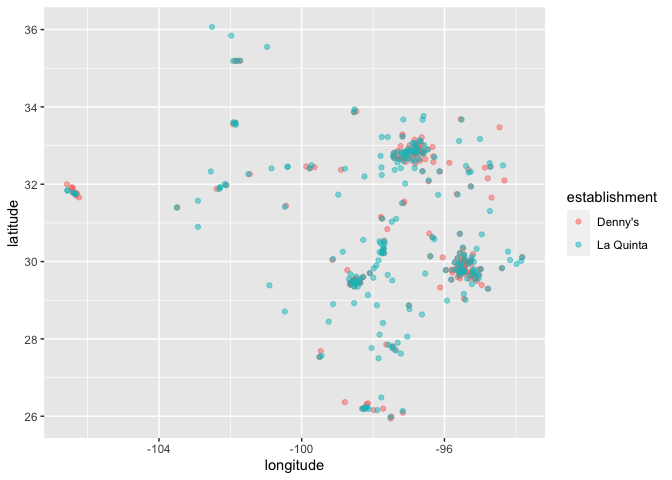

Lab 04 - La Quinta is Spanish for next to Denny’s, Pt. 1
================
Lindsey Wilson
2/5/23

### Load packages and data

``` r
library(tidyverse) 
library(dsbox) 
```

``` r
states <- read.csv("data/states.csv")
dennys <- dennys
laquinta <- laquinta
```

### Exercise 1

Below we have the dimensions of the Denny’s dataset:

``` r
message("The Denny's dataset contains ", nrow(dennys), " rows and ", ncol(dennys), " columns")
```

    ## The Denny's dataset contains 1643 rows and 6 columns

### Exercise 2

And here we have the dimensions of the La Quinta dataset:

``` r
message("The La Quinta dataset contains ", nrow(laquinta), " rows and ", ncol(laquinta), " columns")
```

    ## The La Quinta dataset contains 909 rows and 6 columns

### Exercise 3

Based on the websites given in the lab, it doesn’t look like there are
any Denny’s locations outside the US. However, it does look like there
are a few La Quinta’s outside the US: two in Canada, six in Mexico, two
in China, one in New Zealand, three in Turkey, one in. the UAB, one in.
Chile, and one in Colombia.

### Exercise 4

I can think of a few ways to figure out from the data whether or not
there are Denny’s/La Quinta locations in the US.

One quick way might be to filter out results that don’t have a zip code
(or something weird like ‘00000’)

Another suggestion is to look up the highest/lowest longitude and
latitude in the continental US and then filter out results that fall
outside of the box defined by those coordinates. You could take a
similar approach for Hawaii and Alaska to cover them as well.

### Exercise 5

The code below calculates the number Denny’s outside the US by filtering
out Denny’s locations with a state code that isn’t in the `states`
dataset and then counting the number of rows left over:

``` r
dennys_outside_US_count <- dennys %>%
  filter(!(state %in% states$abbreviation)) %>%
  nrow()

  message("There are ", dennys_outside_US_count, " Denny's locations outside the US")
```

    ## There are 0 Denny's locations outside the US

### Exercise 6

Since we know there aren’t any Denny’s outside the US, we can go ahead
and add a country variable to the Denny’s dataset and set the value for
all rows as “United States”

``` r
dennys <- dennys %>%
  mutate(country = "United States")
```

### Exercise 7

We can take the same approach to find how many La Quinta locations are
outside the US as well:

``` r
laquinta_outside_US_count <- laquinta %>%
  filter(!(state %in% states$abbreviation)) %>%
  nrow()

  message("There are ", laquinta_outside_US_count, " La Quinta locations outside the US")
```

    ## There are 14 La Quinta locations outside the US

And a little extra code gives us more information about those locations:

``` r
laquinta_outside_US <- laquinta %>%
   filter(!(state %in% states$abbreviation))

laquinta_outside_US
```

    ## # A tibble: 14 × 6
    ##    address                                     city  state zip   longi…¹ latit…²
    ##    <chr>                                       <chr> <chr> <chr>   <dbl>   <dbl>
    ##  1 Carretera Panamericana Sur KM 12            "\nA… AG    20345  -102.    21.8 
    ##  2 Av. Tulum Mza. 14 S.M. 4 Lote 2             "\nC… QR    77500   -86.8   21.2 
    ##  3 Ejercito Nacional 8211                      "Col… CH    32528  -106.    31.7 
    ##  4 Blvd. Aeropuerto 4001                       "Par… NL    66600  -100.    25.8 
    ##  5 Carrera 38 # 26-13 Avenida las Palmas con … "\nM… ANT   0500…   -75.6    6.22
    ##  6 AV. PINO SUAREZ No. 1001                    "Col… NL    64000  -100.    25.7 
    ##  7 Av. Fidel Velazquez #3000 Col. Central      "\nM… NL    64190  -100.    25.7 
    ##  8 63 King Street East                         "\nO… ON    L1H1…   -78.9   43.9 
    ##  9 Calle Las Torres-1 Colonia Reforma          "\nP… VE    93210   -97.4   20.6 
    ## 10 Blvd. Audi N. 3 Ciudad Modelo               "\nS… PU    75010   -97.8   19.2 
    ## 11 Ave. Zeta del Cochero No 407                "Col… PU    72810   -98.2   19.0 
    ## 12 Av. Benito Juarez 1230 B (Carretera 57) Co… "\nS… SL    78399  -101.    22.1 
    ## 13 Blvd. Fuerza Armadas                        "con… FM    11101   -87.2   14.1 
    ## 14 8640 Alexandra Rd                           "\nR… BC    V6X1…  -123.    49.2 
    ## # … with abbreviated variable names ¹​longitude, ²​latitude

### Exercise 8

After some Googling, I’m able to figure out which countries these
locations are in based on their country codes:

Codes AG, QR, CH, NL, VE, PU, and SL are in Mexico; Code ANT is in
Colombia; Codes ON and BC are in Canada; and Code FM in is Honduras.

We can use this knowledge to add a country code to the La Quinta data as
well, and then filter the data so that we’re only working with
observations from within the US:

``` r
laquinta <- laquinta %>%
  mutate(country = case_when(
    state %in% state.abb     ~ "United States",
    state %in% c("AG", "QR", "CH",  "NL", "VE", "PU", "SL")  ~"Mexico",
    state %in% c("ON", "BC") ~ "Canada",
    state == "ANT"           ~ "Colombia",
    state == "FM"            ~ "Honduras" 
    ))

laquinta <- laquinta %>%
  filter(country == "United States")
```

### Exercise 9

It looks like California has the most Denny’s locations (with 403),
while Delaware has the fewest (just 1)

``` r
dennys %>%
  count(state) %>%
  arrange(desc(n)) %>%
  print(n = 100)
```

    ## # A tibble: 51 × 2
    ##    state     n
    ##    <chr> <int>
    ##  1 CA      403
    ##  2 TX      200
    ##  3 FL      140
    ##  4 AZ       83
    ##  5 IL       56
    ##  6 NY       56
    ##  7 WA       49
    ##  8 OH       44
    ##  9 MO       42
    ## 10 PA       40
    ## 11 IN       37
    ## 12 NV       35
    ## 13 CO       29
    ## 14 NC       28
    ## 15 NM       28
    ## 16 VA       28
    ## 17 UT       27
    ## 18 MD       26
    ## 19 WI       25
    ## 20 OR       24
    ## 21 GA       22
    ## 22 MI       22
    ## 23 SC       17
    ## 24 KY       16
    ## 25 MN       15
    ## 26 OK       15
    ## 27 CT       12
    ## 28 ID       11
    ## 29 NJ       10
    ## 30 AR        9
    ## 31 KS        8
    ## 32 MA        8
    ## 33 AL        7
    ## 34 ME        7
    ## 35 TN        7
    ## 36 HI        6
    ## 37 MS        5
    ## 38 NE        5
    ## 39 RI        5
    ## 40 LA        4
    ## 41 MT        4
    ## 42 ND        4
    ## 43 WY        4
    ## 44 AK        3
    ## 45 IA        3
    ## 46 NH        3
    ## 47 SD        3
    ## 48 WV        3
    ## 49 DC        2
    ## 50 VT        2
    ## 51 DE        1

For La Quinta, it looks like Texas has the most locations (237) and
Maine has the fewest (1)

``` r
laquinta %>%
  count(state) %>%
  arrange(desc(n)) %>%
  print(n=100)
```

    ## # A tibble: 48 × 2
    ##    state     n
    ##    <chr> <int>
    ##  1 TX      237
    ##  2 FL       74
    ##  3 CA       56
    ##  4 GA       41
    ##  5 TN       30
    ##  6 OK       29
    ##  7 LA       28
    ##  8 CO       27
    ##  9 NM       19
    ## 10 NY       19
    ## 11 AZ       18
    ## 12 IL       17
    ## 13 IN       17
    ## 14 OH       17
    ## 15 AL       16
    ## 16 WA       16
    ## 17 VA       14
    ## 18 AR       13
    ## 19 MD       13
    ## 20 WI       13
    ## 21 MO       12
    ## 22 MS       12
    ## 23 NC       12
    ## 24 UT       12
    ## 25 ID       10
    ## 26 KY       10
    ## 27 OR       10
    ## 28 PA       10
    ## 29 KS        9
    ## 30 MT        9
    ## 31 NV        8
    ## 32 SC        8
    ## 33 MN        7
    ## 34 CT        6
    ## 35 MA        6
    ## 36 ND        5
    ## 37 NE        5
    ## 38 NJ        5
    ## 39 IA        4
    ## 40 MI        4
    ## 41 WV        3
    ## 42 WY        3
    ## 43 AK        2
    ## 44 NH        2
    ## 45 RI        2
    ## 46 SD        2
    ## 47 VT        2
    ## 48 ME        1

### Exercise 10

To figure out how many locations of Denny’s and La Quinta are in each
state per 1000 miles, we have to combine the counts of each location per
state with the `states` data frame. We can then create a new variable
within each merged data frame called “LocationsPerArea” that divides the
location count per state by (area/1000). Finally, we can sort each data
frame in descending order by this new variable.

Below, we can see that DC has the highest concentration of Denny’s (29.2
per 1000 square miles), and Rhode Island has the highest concentration
of La Quinta (1.29 per 1000 square miles)

``` r
dennys_joined <- dennys %>%
  count(state) %>%
  inner_join(states, by = c("state" = "abbreviation")) %>%
  mutate(LocationsPerArea = n/(area/1000)) %>%
  arrange(desc(LocationsPerArea))
dennys_joined
```

    ## # A tibble: 51 × 5
    ##    state     n name                     area LocationsPerArea
    ##    <chr> <int> <chr>                   <dbl>            <dbl>
    ##  1 DC        2 District of Columbia     68.3           29.3  
    ##  2 RI        5 Rhode Island           1545.             3.24 
    ##  3 CA      403 California           163695.             2.46 
    ##  4 CT       12 Connecticut            5543.             2.16 
    ##  5 FL      140 Florida               65758.             2.13 
    ##  6 MD       26 Maryland              12406.             2.10 
    ##  7 NJ       10 New Jersey             8723.             1.15 
    ##  8 NY       56 New York              54555.             1.03 
    ##  9 IN       37 Indiana               36420.             1.02 
    ## 10 OH       44 Ohio                  44826.             0.982
    ## # … with 41 more rows

``` r
laquinta_joined <- laquinta %>%
  count(state) %>%
  inner_join(states, by = c("state" = "abbreviation")) %>%
  mutate(LocationsPerArea = n/(area/1000)) %>%
  arrange(desc(LocationsPerArea))
laquinta_joined
```

    ## # A tibble: 48 × 5
    ##    state     n name             area LocationsPerArea
    ##    <chr> <int> <chr>           <dbl>            <dbl>
    ##  1 RI        2 Rhode Island    1545.            1.29 
    ##  2 FL       74 Florida        65758.            1.13 
    ##  3 CT        6 Connecticut     5543.            1.08 
    ##  4 MD       13 Maryland       12406.            1.05 
    ##  5 TX      237 Texas         268596.            0.882
    ##  6 TN       30 Tennessee      42144.            0.712
    ##  7 GA       41 Georgia        59425.            0.690
    ##  8 NJ        5 New Jersey      8723.            0.573
    ##  9 MA        6 Massachusetts  10554.            0.568
    ## 10 LA       28 Louisiana      52378.            0.535
    ## # … with 38 more rows

### Exercise 11

To compare the locations of Denny’s and La Quinta, we need to combine
the two datasets together. The code to do that is given below:

``` r
dennys <- dennys %>%
  mutate(establishment = "Denny's")
laquinta <- laquinta %>%
  mutate(establishment = "La Quinta")

dn_lq <- bind_rows(dennys, laquinta)
```

And now that the datasets are joined, we can make a scatterplot of
latitude vs. longitude for the two establishments. This should allow us
to literally see where they are in relation to one another:

``` r
ggplot(dn_lq, mapping = aes(x = longitude,
                            y = latitude,
                            color = establishment)) +
  geom_point()
```

<!-- -->

Let’s filter this to look just at the data for North Carolina:

``` r
dn_lq %>%
  filter(state == "NC") %>%
ggplot(mapping = aes(x = longitude,
                     y = latitude,
                     color = establishment)) +
  geom_point(alpha = 0.7)
```

<!-- -->

I’d say this provides some support for Mitch Hedberg’s joke. Not every
Denny’s is right next to a La Quinta, but there are quite a few with a
La Quinta very close by.

### Exercise 12

Now let’s do the same analysis for Texas:

``` r
dn_lq %>%
  filter(state == "TX") %>%
ggplot(mapping = aes(x = longitude,
                     y = latitude,
                     color = establishment)) +
  geom_point(alpha = 0.5)
```

<!-- --> This
is a lot more visually striking. It looks like there are a few
population centers in Texas, and those are rich with both Denny’s and La
Quintas. And even for those outside of the big clusters, the proximity
is a little uncanny.

Looks like Mitch was onto something!
